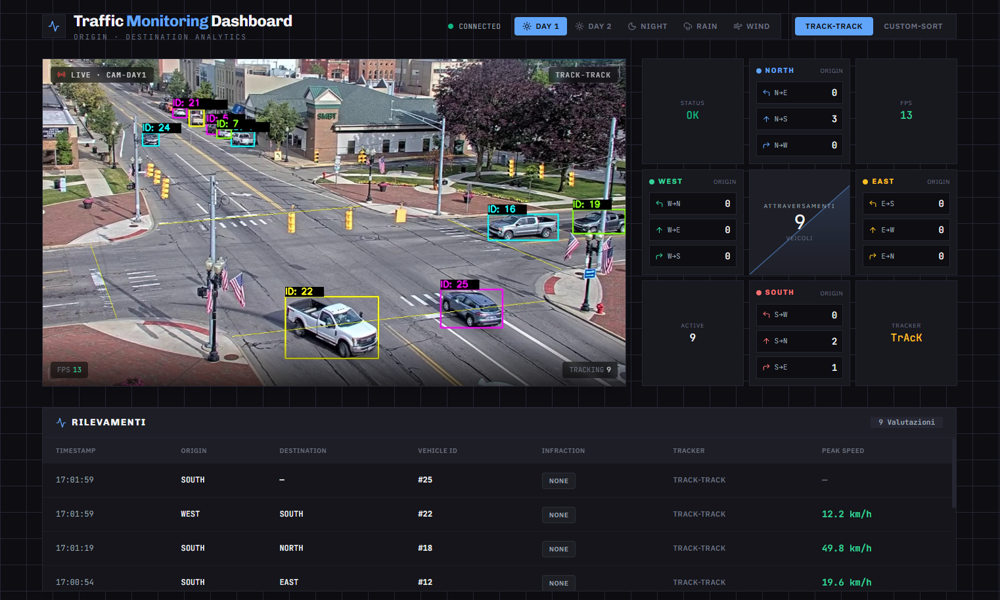

# **🚦 Traffic Monitoring Dashboard**

## **📖 Project Overview**
This project is a complete, full-stack Computer Vision application designed to solve a real-world problem: Automated Traffic Monitoring at Urban Intersections.

The system detects, tracks, and analyzes vehicles in real-time across various challenging environmental conditions (e.g., night-time headlight glare, heavy rain) providing actionable intelligence such as routing analysis, active vehicle counting, and speeding infractions.

The project features a modular Python backend (FastAPI, OpenCV, Ultralytics YOLOv8) coupled with a modern, responsive React frontend dashboard.

## **⚙️ Architecture & Pipeline Description**

The application pipeline is highly modular and designed to handle environmental edge cases robustly:

1. **Data Acquisition & Preprocessing:**  
   * Video feeds are processed using a thread-safe queue to ensure real-time performance without dropping frames.  
   * **Dynamic Filtering:** Depending on the weather condition, the pipeline applies specific OpenCV filters: **Gamma Correction** and **CLAHE** (for night-time contrast enhancement and headlight glare reduction), and **Bilateral Filtering** (to smooth out rain artifacts while preserving vehicle edges).  
2. **Feature Engineering & Detection:**  
   * Utilizing **YOLOv8s** (pre-trained on COCO) as the core detector to locate vehicles accurately.  
   * A dynamic *Class Alignment* script was implemented to map custom dataset evaluations seamlessly to the COCO car class.  
3. **Core Tracking Logic:**  
   * **Track-Track (Default):** Based on the TrackTrack architecture, it utilizes NSA Kalman filters, sparse optical flow (ECC) for camera motion compensation, and appearance-based features to maintain IDs across occlusions and dense traffic.  
   * **Custom-SORT:** A pedagogical baseline tracker built from scratch using SciPy's Hungarian algorithm, Kalman filters, and EMA appearance updates to demonstrate the limitations of tracking in dense traffic.  
4. **Post-Processing & Analytics:**  
   * **Homography (Bird's Eye View):** 2D pixel coordinates are projected into a 3D physical space metric matrix to accurately calculate vehicle speed (km/h).  
   * **ID Stitching:** A custom algorithm recovers fragmented trajectories caused by temporary occlusions or severe glare, ensuring accurate origin-to-destination routing appraisals.

## **🚀 Setup and Running Instructions**

### **Prerequisites**

* Python 3.10+  
* Node.js (v16 or higher) & npm

### **Backend Setup**

Navigate to the project root directory and set up the Python environment:

<pre>
  
# Create a virtual environment  
python \-m venv venv

# Activate the virtual environment  
# On Windows:  
venv\\Scripts\\activate  
# On macOS/Linux:  
source venv/bin/activate

# Install dependencies  
pip install \-r requirements.txt

# Start the app & the FastAPI server  
python backend/main.py
  
</pre>

*The backend will be running at http://localhost:8000*

### **Frontend Setup**

Open a new terminal window, navigate to the frontend folder, and start the React app:

<pre>
  
cd frontend

# Install Node modules  
npm install

# Start the Vite development server  
npm run dev

</pre>
The interactive dashboard will be available at http://localhost:5173

The whole project can also be started using only one line command in the main folder: ` npm run dev `, this requires you to install its separate dependence, that can be installed running the command ` npm i ` just once, in the project's main folder.

## **🧪 Experimental Results**

The system was evaluated on a custom dataset of 17 images and 67 vehicle instances extracted from real-world feeds obtained in different atmospheric conditions.

The evaluation was performed using the standard COCO detection metrics focused on the car class:

* **mAP@50:** 83.89% (High overall robustness in bounding box localization)  
* **mAP@50-95:** 63.64% (Strict precision metric)  
* **Precision (P):** 82.3% (Low rate of false positives)  
* **Recall (R):** 70.1% (Analyzed and mitigated in the post-processing ID stitching module)

For a comprehensive breakdown of the methodology, algorithm choices, and failure analysis, please refer to the technical analysis pdf file included in this repository.

## **📂 Repository Structure**
<pre>
├── backend/  
│   ├── data/raw/           # Raw video feeds (Ignored in git)  
│   ├── trackers/           # Tracking algorithms (Custom-SORT, Track-Track)  
│   ├── weights/            # YOLOv8 pre-trained models  
│   ├── camera.py           # Threaded video capture and preprocessing  
│   ├── traffic_analyzer.py # Homography, Speed calculation, and ID Stitching  
│   └── main.py             # FastAPI server entry point  
├── frontend/  
│   ├── src/                # React components and hooks  
│   ├── package.json        # Node dependencies  
│   └── vite.config.js      # Frontend build config
├── img/                    # Images used in this readme
├── evaluate.py             # Script for mAP/IoU performance evaluation
├── extract_frames.py       # Utility used to extract frames for testing purposes
├── package.json            # Script used for launching the whole app with a command
├── requirements.txt        # Python dependencies  
├── README.md               # Project documentation  
└── Technical Analysis.pdf  # Technical analysis document
</pre>